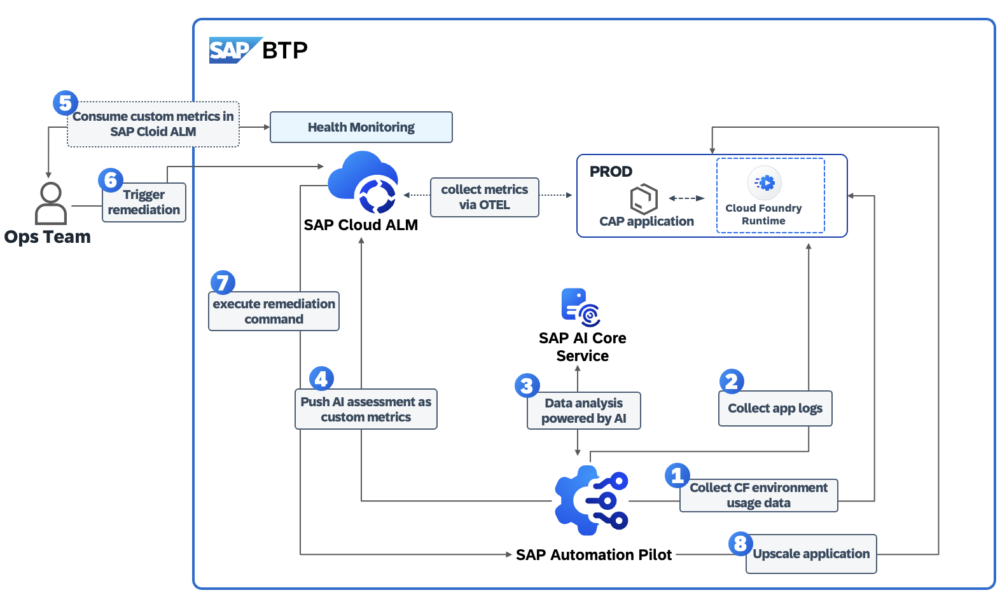

# Session ID - XP267 | Experience the automation of technical operation tasks on SAP BTP

## Description
This repository contains the material for the SAP TechEd 2025 wiht Session ID XP267 - **"Experience the automation of technical operation tasks on SAP BTP"**

## Overview

This session introduces attendees to SAP Automation Pilot and SAP Cloud ALM in the context of Day 2 Operations. Main goail is participants to gain practical experience in automating different set of technical operation tasks in SAP Business Technology Platform (SAP BTP). To do so, by setting up an integration between SAP Automation Pilot and SAP Cloud ALM, during this hands-on we will explore how to trigger ready-to-use commands in SAP Automation Pilot to do troubleshooting and perform remediation actions based on alerts in SAP Cloud ALM. You will also learn how to build your own automation flows or extend existing ones.

## **Main scenario covered during this session:**
 
Within the hands-on tutorial we will cover: 
- Introduction to **SAP Automation Pilot** for running repetitive ops tasks
- Introduction to **SAP Cloud ALM**
- Extending SAP Automation Pilot by an integration to SAP AI Core service for **assessment of technical data and recommendations by AI**
- Integration between SAP Automation Pilot and SAP Cloud ALM for  automating **operational tasks and remediations**

**Hands-on:**
  - Creating and testing **automation workflows** for common operational tasks.
  - Extending SAP Automation Pilot by integrating it to SAP AI Core service.
  - Exploring potential **use cases** where SAP Automation Pilot and SAP Cloud ALM adds value for Ops teams by using GenAI features provided by SAP

## Products in focus 
### SAP Automation Pilot 
The goal of SAP Automation Pilot is to simplify and automate complex manual technical processes and flows. This enables DevOps teams to run their solutions on SAP BTP with minimal operational effort.

#### SAP Automation Pilot is a low-code / no-code automation engine that allows you to:
- Automate sequences of steps,
- Execute scripts in a serverless manner,
- Use catalogs of commands provided by SAP to automate typical Ops tasks in and outside your SAP BTP landscape,
- Build custom automations.
 
Automations in SAP Automation Pilot can be triggered in various ways to best fit your operational needs - manually by the DevOps team, through the built-in scheduler, automatically via integration with services and ops platforms like SAP Cloud ALM, or by other applications and systems.

The service is designed to work with low latency, even under a heavy workload, and is capable of triggering hundreds of automations simultaneously.

### SAP Cloud ALM for Operations

##  **Let's Build & Automate!**
This TechEd session is **interactive  hands-on**, ensuring you gain **real-world experience** with products and tools delivered by SAP. Get ready for your Day 2 Operations activities!

## Requirements
The requirements to follow the exercises in this repository are: 
- Access to SAP Automation Pilot
- Access to SAP Cloud ALM
- A Cloud Foundry CAP application
- SAP AI Core credentials and a GPT-4o deployment
- "Technical user" on your SAP BTP Cloud Foundry space (already provided to each participant)

## Exercises
Let's start the excercise - for a better understanding, please follow the excercises as listed below:
Continue to: 
- [Getting Started](exercises/ex0/)

## Contributing
Please read the [CONTRIBUTING.md](./CONTRIBUTING.md) to understand the contribution guidelines.

## Code of Conduct
Please read the [SAP Open Source Code of Conduct](https://github.com/SAP-samples/.github/blob/main/CODE_OF_CONDUCT.md).

## How to obtain support

Support for the content in this repository is available during the actual time of the online session for which this content has been designed. Otherwise, you may request support via the [Issues](../../issues) tab.

## License
Copyright (c) 2024 SAP SE or an SAP affiliate company. All rights reserved. This project is licensed under the Apache Software License, version 2.0 except as noted otherwise in the [LICENSE](LICENSES/Apache-2.0.txt) file.
