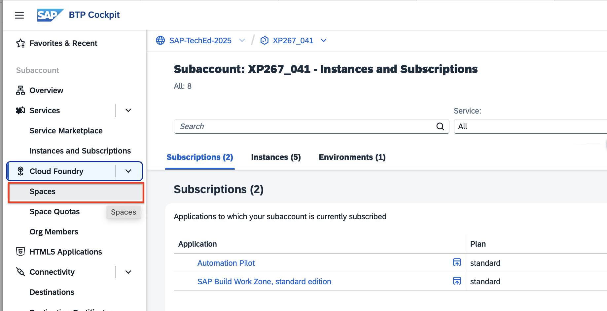
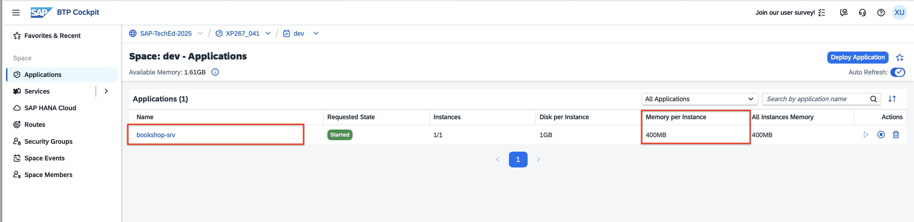
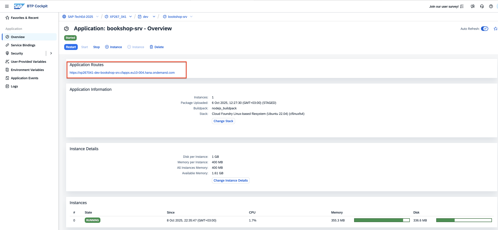
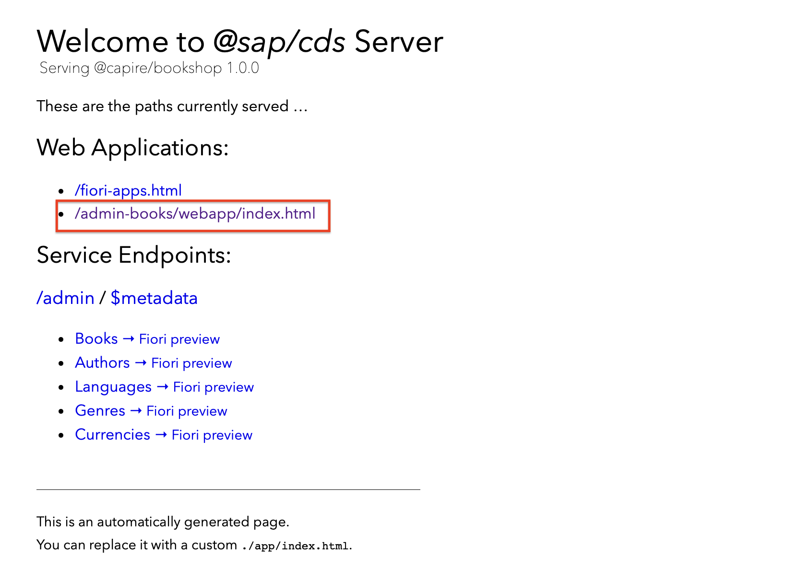
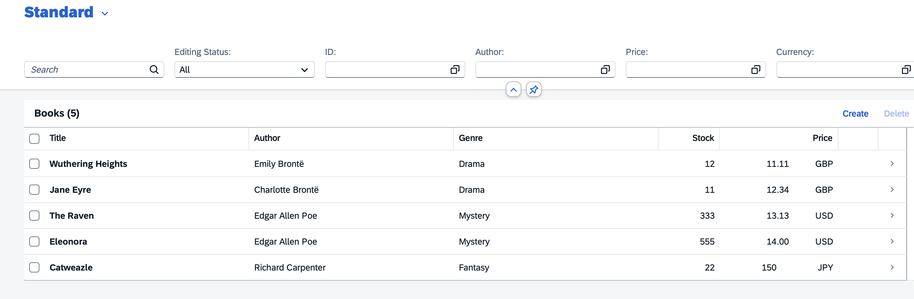

# Exercise 0 – Get to Know Your Environment and Cloud Foundry Application

In this exercise, you will familiarize yourself with your **SAP BTP account**, your **Cloud Foundry (CF) environment**, and the **CAP application** deployed in it.  

---

## Objective

After completing this exercise, you will:  
- Understand the structure of your Cloud Foundry demo environment.  
- Identify and inspect the running **CAP (Cloud Application Programming)** application.  
- Access the application’s UI to verify that it runs correctly.  

---

## Step 1 – Access Your Cloud Foundry Environment

> 💡 **Note:**  
> The CAP application is a **Node.js** service already deployed and instrumented with an **OpenTelemetry (OTEL)** library, which allows it to push operational metrics to **SAP Cloud ALM**.

1. Open your **SAP BTP Cockpit** and navigate to your subaccount.  
   Your subaccount name follows the pattern:  
   `XP267-0XX` (for example, `XP267-041`).

2. From the left-side menu, expand **Cloud Foundry** → **Spaces**.  
   

3. Click on the **dev** space — this is your development environment.  
   

4. You will now see a list of applications running in your **dev** space.  
   Locate the app named **`bookshop-srv`** with status **“Started.”**  
   

---

## Step 2 – Review the Application Details

1. Review the visible parameters for your app.  
   You’ll notice that each instance has **400 MB of allocated memory**.  

2. Click on the application name `bookshop-srv` to open the **Overview** tab.  
   Observe the **memory usage metrics** — the app typically uses slightly less than the 400 MB allocated.  
   

---

## Step 3 – Access the Application UI

1. Click on the **application route link** to open the CAP application.  
   

2. On the landing page (the CDS server page), click the link to: `/admin-books/webapp/index.html`
   This will open the **Admin Books** web application.
   

4. You should see a page similar to the one below, confirming that the application is running successfully:
   

---

## Summary

You have successfully:  
- Verified that your **CAP application** runs in your Cloud Foundry environment.  
- Observed the **resource allocation and runtime usage** of your app.  
- Accessed the application’s **web interface** to confirm it is operational.  

Proceed to the next step:  
➡️ [Exercise 1 – Introduction to SAP Automation Pilot](../ex1/README.md)

