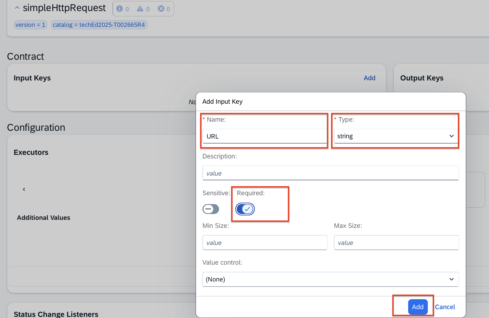
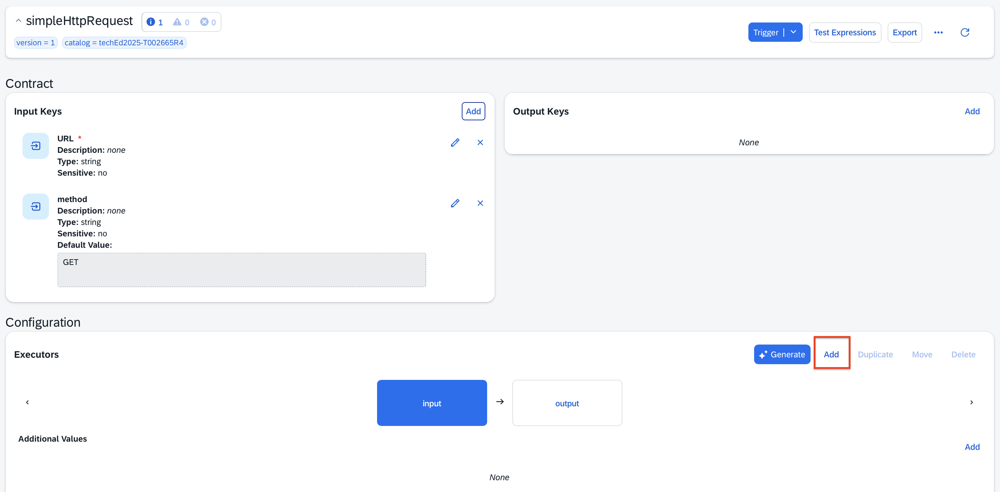
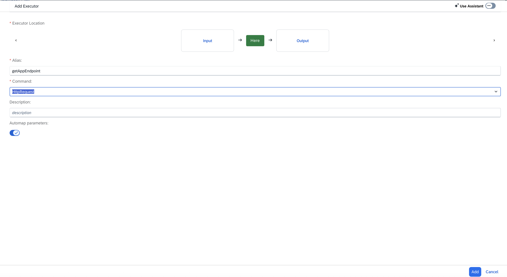
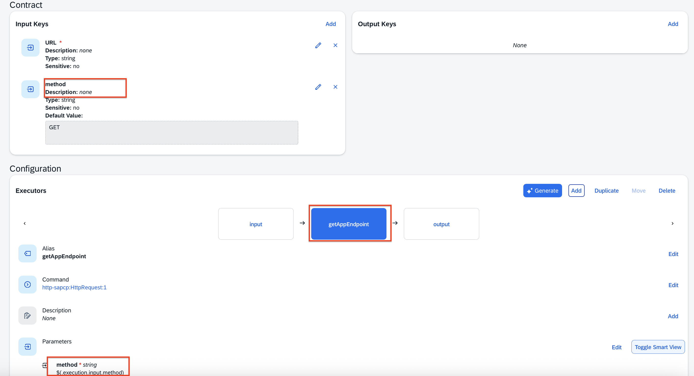
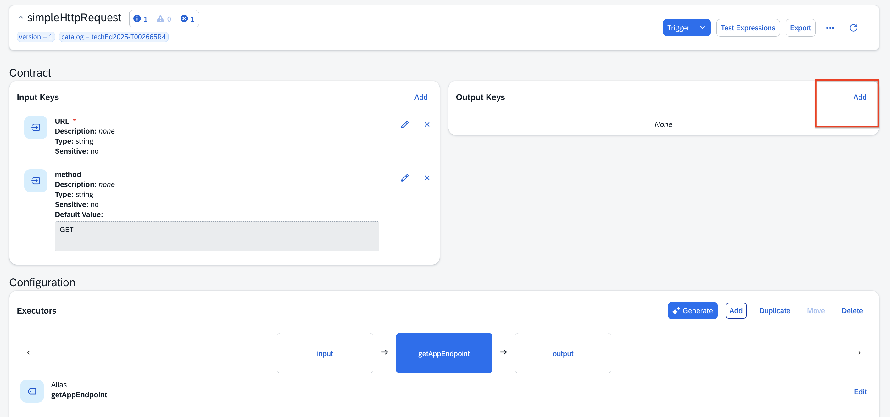
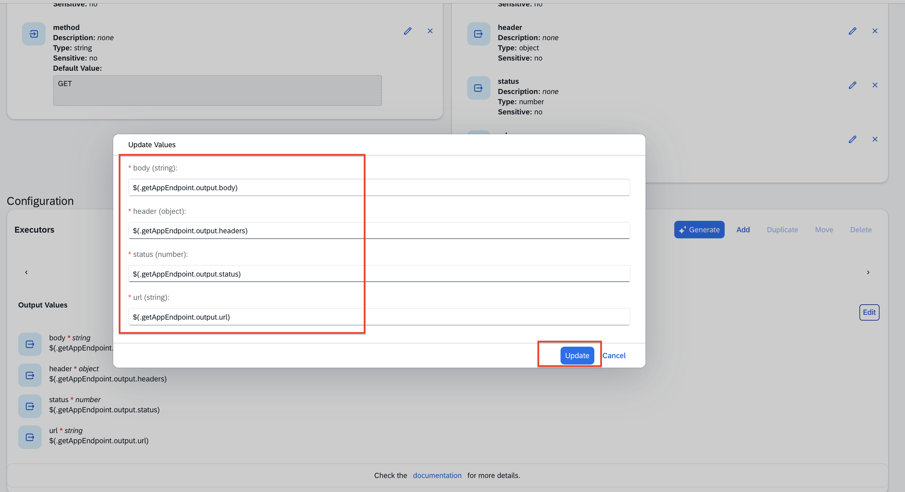
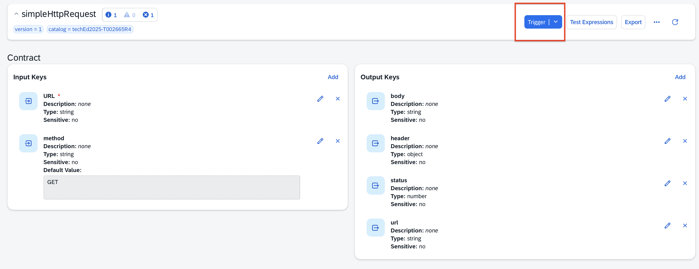
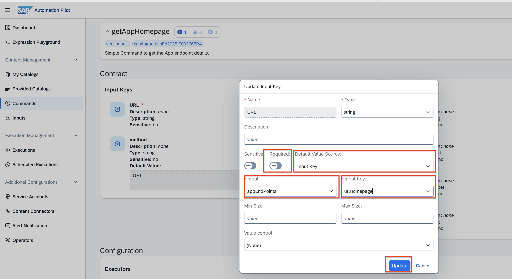
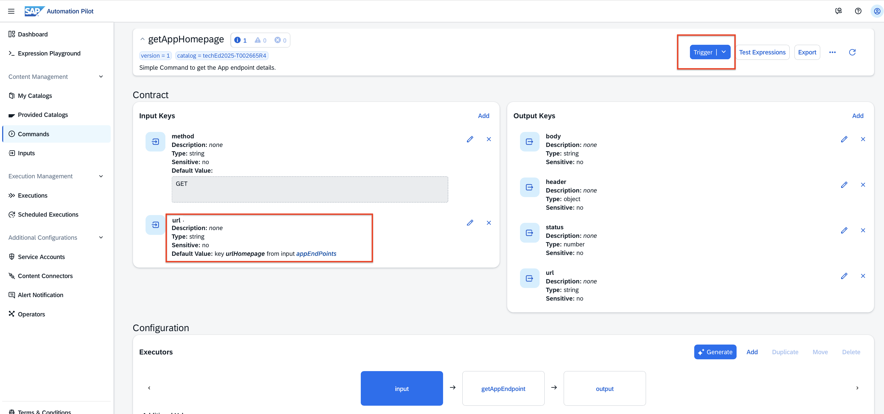

# Exercise 1 – Access SAP Cloud ALM and Trigger Commands to Your App via SAP Automation Pilot

In this exercise, you will:  
- Access **SAP Cloud ALM** and explore metrics in **Health Monitoring**  
- Interact with application endpoints via **SAP Automation Pilot**  
- Set up the integration between **SAP Cloud ALM** and **SAP Automation Pilot**

For a better understanding of the use case, refer to the diagram below:  

---

## Exercise 1.1 – Access SAP Cloud ALM and Explore Health Monitoring Metrics

1. Access **SAP Cloud ALM**:  
   [https://xp267-calm-1hdji9xc.eu10-004.alm.cloud.sap/](https://xp267-calm-1hdji9xc.eu10-004.alm.cloud.sap/)

2. **Log in** with your provided user credentials.  

3. From the main menu, select **Operations**.  
   

4. Click on **Health Monitoring**.  
   

5. You will land on the **Health Monitoring Overview** screen.  
   Make sure the **Scope** is set to your subaccount, e.g. `XP267-0XX_CF` (for example, `XP267_001_CF`).  
   

6. Click on the tile to view all available services and systems in Health Monitoring.  
   

7. Click on a service to access the **SAP BTP Cloud Foundry Metrics Overview**.  
   These are metrics ingested from your CAP app through **OpenTelemetry**.  
   

8. Optionally, click on the **All Metrics** tab to explore the collected metrics in detail.  
   

✅ **Well done!** You can now monitor the health of your CAP app.  
Next, you will explore **SAP Automation Pilot** and interact with your app endpoints.

---

## Exercise 1.2 – Interact with App Endpoints via SAP Automation Pilot

### Exercise 1.2.1 – Explore Main Sections in SAP Automation Pilot

1. Return to your **SAP BTP subaccount** (`XP267-0XX`, for example, `XP267-001`).  

2. From the left-side menu, go to **Services → Instances and Subscriptions**.  

3. Under **Subscriptions**, click on **Automation Pilot**.  
   

4. You will land on the **SAP Automation Pilot Dashboard**.  
   

5. From the left menu, open **Provided Catalogs**.  
   Browse through the 300+ ready-to-use automation commands grouped by catalogs.  
   

You can also explore:  
- **My Catalogs** – your custom and extended commands  
- **Commands** – all commands available to your user  
- **Inputs** – reusable parameters that can be referenced in commands  

---

### Exercise 1.2.2 – Build Your First Command in SAP Automation Pilot

Let’s create your first custom command.

1. Navigate to **My Catalogs** → open **Commands** from the catalog named **XP267 Ex01 – Kick Start Commands**.  
   

2. Click **Create**.  
   

3. Fill in the details:  
   - **Catalog**: `XP267 Ex01 – Kick Start Commands`  
   - **Name**: `simpleHttpRequest`  

   Click **Create**.  
   

4. The command is created but currently has no inputs, outputs, or executors.  
   

#### Add Inputs

1. Click **Add** under the **Input Keys** section.  
   

   Fill in:  
   - **Name**: `url`  
   - **Type**: `string`  
   - Mark as **Required**  
   Click **Add**.  
   

2. Add another input key to define the HTTP method:  
   - **Name**: `method`  
   - **Type**: `string`  
   - **Default Value Source**: `Static`  
   - **Value**: `GET`  
   Click **Add**.  
   

#### Add Executor

1. Click **Add** under the **Executors** section.  
   

2. In the **Add Executor** dialog:  
   - Click **Here** to define the execution order  
   - **Alias**: `getAppEndpoint`  
   - **Command**: `HttpRequest`  
   - Keep **Automap parameters** enabled  
   Click **Add**.  
   

   You will now see the executor added with mapped parameters.  
   

#### Add Outputs

1. Click **Add** under the **Output Keys** section.  
   

   Add the following outputs:  
   - **Name**: `url` – **Type**: `string`  
   - **Name**: `status` – **Type**: `number`  
   - **Name**: `header` – **Type**: `object`  
   - **Name**: `body` – **Type**: `string`  
   

2. Map outputs to their respective values:  
   - **body**: `$(.getAppEndpoint.output.body)`  
   - **header**: `$(.getAppEndpoint.output.headers)`  
   - **status**: `$(.getAppEndpoint.output.status)`  
   - **url**: `$(.getAppEndpoint.output.url)`  
   Click **Update**.  
   

#### Trigger the Command

1. Click **Trigger**.  
   

2. Provide the **URL** of your Bookshop web app (copied from Exercise 0) and click **Trigger**.  
   

3. Once complete, click **Show** under **Output** to view the returned values.  
   

✅ The command executed successfully and returned outputs such as status, headers, and response body.

---

### Optional – Using Stored Input Keys

You can store and reuse input values in **SAP Automation Pilot**:

1. Click **Inputs** in the left menu.  
   

2. Select the input set `appEndPoints` and click the **Edit** icon.  
   

3. Update the `urlHomepage` value with your app’s URL and **Save**.  
   

4. Go back to your **Kick Start Catalog** and open the `getAppHomepage` command.  
   

5. Edit the **URL** input key to reference the stored value:  
   - Uncheck **Required**  
   - **Default Value Source**: `Input Key`  
   - **Input**: `appEndPoints`  
   - **Input Key**: `urlHomepage`  
   Click **Update**.  
   

6. Trigger the command again — it will now automatically use the stored input value.  
   

✅ You’ve learned how to create, execute, and reuse inputs for commands in SAP Automation Pilot.

---

## Exercise 1.3 – Set Up Integration Between SAP Cloud ALM and SAP Automation Pilot

Now, let’s integrate **SAP Cloud ALM** with **SAP Automation Pilot**.

### Step 1 – Gather Required Values from SAP Automation Pilot

In **SAP Automation Pilot**, click on the **User** menu (bottom left corner) and copy the following:  
- Tenant ID  
- Tenant URL  

Then click **API** (bottom left menu) and copy the **Base URL**.  

### Step 2 – Create a Service Account

1. In the left menu, go to **Service Accounts** → **Create**.  
   

2. Fill in:  
   - **Username**: `cloudALM`  
   - **Description**: e.g. *Service account used in SAP Cloud ALM to trigger commands in SAP Automation Pilot*  
   - **Permissions**: `Read`, `Write`, `Execute`  
   - **Authentication Type**: `Basic`  

   Click **Create**.  
   

3. Copy the **Username** and **Password** immediately — the password will not be displayed again.  
   

Click **Close** when done.

You should now have the following values ready:  
- Tenant ID  
- Tenant URL  
- Base URL  
- Username  
- Password  

---

### Step 3 – Configure the Connection in SAP Cloud ALM

1. Open **SAP Cloud ALM**:  
   [https://xp267-calm-1hdji9xc.eu10-004.alm.cloud.sap/](https://xp267-calm-1hdji9xc.eu10-004.alm.cloud.sap/)

2. Go to **Operations → Landscape Management**.  
   

3. From the left sidebar, select **Services and Systems** → click **Add New Service**.  
   

4. Fill in the **Add Service** form:  
   - **Name**: `AP-XP267-0XX` (e.g. `AP-XP267-041`)  
   - **System Number**: *Tenant ID* (copied earlier)  
   - **Service Type**: `SAP Automation Pilot`  
   - **Role**: `Test`  
   - **Root URL**: *Tenant URL*  
   - **Deployment Model**: `BTP System`  

   Click **Save**.  
   

5. Select the newly created service and open its details.  
   

6. Go to the **Endpoints** tab → click **Add**.  
   

7. Fill in the endpoint details:  
   - **Endpoint Name**: `AP-XP267-0XX`  
   - **Root URL**: *Base URL*  
   - **Authentication**: Basic  
   - **User**: *Username*  
   - **Password**: *Password*  
   Click **Save**.  
   

8. After saving, click **Ping Connection** to verify the setup.  
   

✅ **Success!** The endpoint connection is active. You can now trigger Automation Pilot commands directly from **SAP Cloud ALM**.  
   

---

## Summary

You have successfully:  
- Explored **SAP Cloud ALM Health Monitoring**  
- Created and executed commands in **SAP Automation Pilot**  
- Integrated both products for automated operational actions  

Proceed to the next step:  
➡️ [Exercise 2 – Exercise 2 Description](../ex2/README.md)
