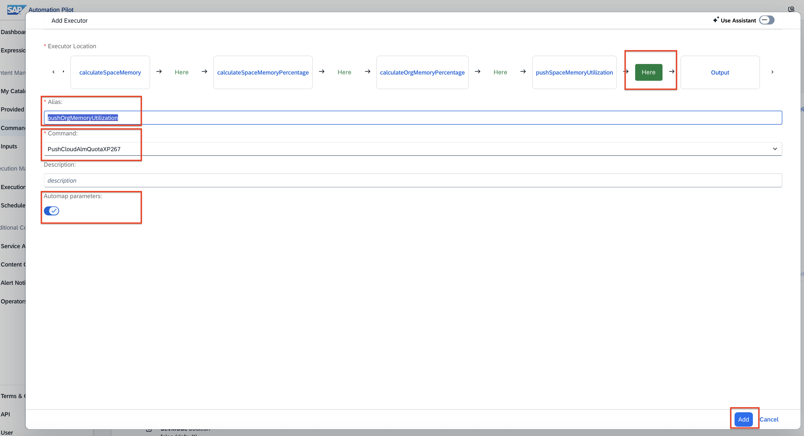
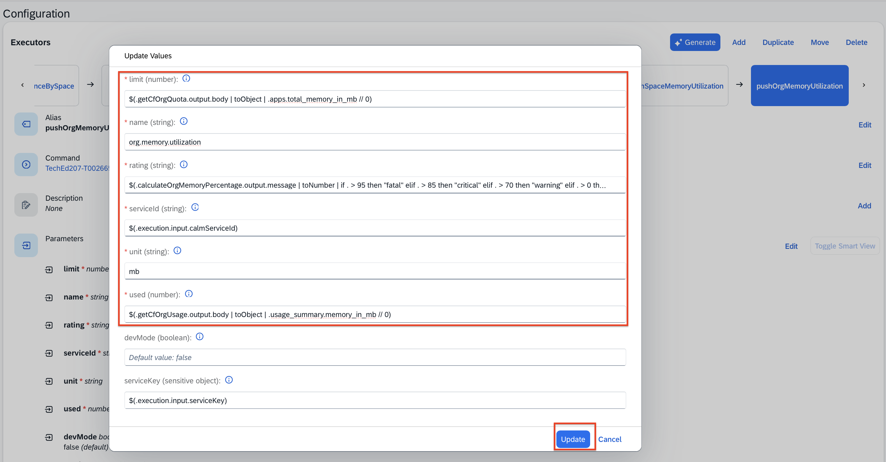

# Exercise 2 - Collect usage metrics with SAP Automation Pilot for you BTP Subaccount and push these to SAP Cloud ALM

In this exercise, we will: 
- Collect usage metrics with SAP Automation Pilot 
- Use existing commands in SAP Automation Pilot to push these metrics to SAP Cloud ALM 
- Consume the custom metrics in SAP Cloud ALM - Health Monitoring  

For a better understanding of the currnet use case, please consult the diagram shared below: 

## Exercise 2.1  Collect usage metrics with SAP Automation Pilot 

**Access SAP Automation Pilot**  and navigate via the left menu to **My Catalogs** --> click on **Commands** for the catalog `XP267 Ex02 - Custom Metrics into Cloud ALM`

Navigate to the command named `CheckResourceQuotaUtilizationXP267Extended`

Thus command is already configured to calculate resource utilization of Cloud Foundry space and its parrent organization for your subaccount. 
**Trigger** the command , no any further inputs are needed. 

After the command succesful execution, consult the output values by clicking on **Show** link under Output. 

That's a current snapshot of the resource utilization of Cloud Foundry space and its parrent organization for your subaccount. 

## Exercise 2.2  Use existing commands in SAP Automation Pilot to push these metrics to SAP Cloud ALM 

Now we want to push these metrics into SAP Cloud ALM - Health Monitoring. To do so, we'll need to extent this existing command. 

**Go to the command itself**, scroll-down to the **Executor section** and click on **Add** button. 

Add the Executor 
- **Place the new executor** just before the Ouput by clickin on **Here** botton.

- **Alias** - `pushSpaceMemoryUtilization` 

- **Command** - `PushCloudAlmQuotaXP267` - that's a command in SAP Automation Pilot that pushes quota data directly into SAP Cloud ALM metrics API.

- **Keep enabled** the `Automap parameters`

- Click on **Add** button

Now navigate to the executor you just created `pushSpaceMemoryUtilization` and click on the **Edit** button to update its parameters. 

Update the values accordingly: 

- **limit** - `$(.getCfSpaceQuota.output.body | toObject | .apps.total_memory_in_mb // 0)`

- **name** - `space.memory.utilization`

- **rating** - `$(.calculateSpaceMemoryPercentage.output.message | toNumber | if . > 95 then "fatal" elif . > 85 then "critical" elif . > 70 then "warning" elif . > 0 then "ok" else "error" end)`

- **serviceId** - `$(.execution.input.calmServiceId)`

- **unit** - `mb`

- **used** - `$(.calculateSpaceMemory.output.spaceMemory // 0)`

Click on the **Update** button. 

Navigate to the executor `pushSpaceMemoryUtilization` and validate the paramters you just had added. It should look like this one:

Now we need to add another executor next to it. The executor is about pushing the current usage for all our CF spaces on Org level (in case we do have more than one CF Space). 

To do so, go to the executors section in your command and click on the **Add** button to add a new executro within you automation flow. 

Add the Executor 
- **Place the new executor** just before the Ouput by clickin on **Here** botton.

- **Alias** - `pushOrgMemoryUtilization` 

- **Command** - `PushCloudAlmQuotaXP267` - that's a command in SAP Automation Pilot that pushes quota data directly into SAP Cloud ALM metrics API.

- **Keep enabled** the `Automap parameters`

- Click on **Add** button

Now navigate to the executor you just created `pushOrgMemoryUtilization` and click on the **Edit** button to update its parameters. 

Update the values accordingly: 

- **limit** - `$(.getCfOrgQuota.output.body | toObject | .apps.total_memory_in_mb // 0)`

- **name** - `org.memory.utilization`

- **rating** - `$(.calculateOrgMemoryPercentage.output.message | toNumber | if . > 95 then "fatal" elif . > 85 then "critical" elif . > 70 then "warning" elif . > 0 then "ok" else "error" end)`

- **serviceId** - `$(.execution.input.calmServiceId)`

- **unit** - `mb`

- **used** - `$(.getCfOrgUsage.output.body | toObject | .usage_summary.memory_in_mb // 0)`

Click on the **Update** button. 

Navigate to the executor `pushOrgMemoryUtilization` and validate the paramters you just had added. It should look like this one:

**Trigger the command in SAP Automation Pilot**
Now it is all set and you can trigger the command in SAP Automation Pilot. 
To do so, click on the **Trigger** button located in the the top righ screen and proceed further as no any further inputs are needed.

**Success** - the commands has been completed and data is pushed to SAP Cloud ALM! 

Now let's check the data imngested into SAP Cloud ALM - Health Monitoring. 

## Exercise 2.3  Consume the custom metrics in SAP Cloud ALM - Health Monitoring

**Access SAP Cloud ALM** by following this link here: https://xp267-calm-1hdji9xc.eu10-004.alm.cloud.sap/

**Login** with your user --> select the **Operations** menu item --> **Health Monitoring**

Within Health Monitoring Overview, click on **Monitoring**

Click on your SAP BTP Cloud Foundry environment `XP267_OXX_CF` (as per the usernam assigned to you, in example, XP267_001_CF) 

You will open the **Metrcis Overview** screen in Health Monitoring. Within the very same screen, scroll-down to **Other Metrics** section and you will find the two metrics ( `org.memory.utilization` and `space.memory.utilization`) with the respective values pushed by SAP Automation Pilot. 
Congrats - you can now feed directly your Obserbavility platform with any metric you might wish to bring in.

From this screen, if you click on any of these two metrics, `space.memory.utilization` in example, you will see further details about the metric such as information, rating, value. Click on the **History** button. 

You could explore how this metric's value had changed over the time and get additional insights. 

### Congrats - you can now feed directly your Obserbavility platform with any metric you might wish to bring in.

## Summary

You've now learned how to extend your commands in SAP Automation Pilot by adding new executors to them and resuing also existing command. Moreover, you had manage to trigger command in Automation Pilot that collects further details about your landscape and consume these in a central observability platform such as SAP Cloud ALM. Once that's done, metrics' data is kept in SAP Cloud ALM and it gets visualised in a dashboard such as Metrics Overview in Health Monitoring for further exploration and analysis.

Continue to - [Exercise 3 - Exercise 3 Description](../ex3/README.md)
