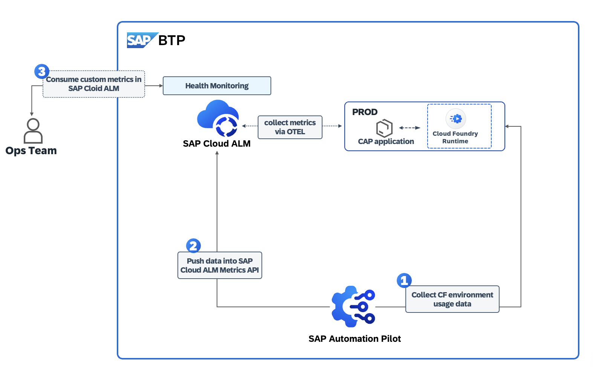
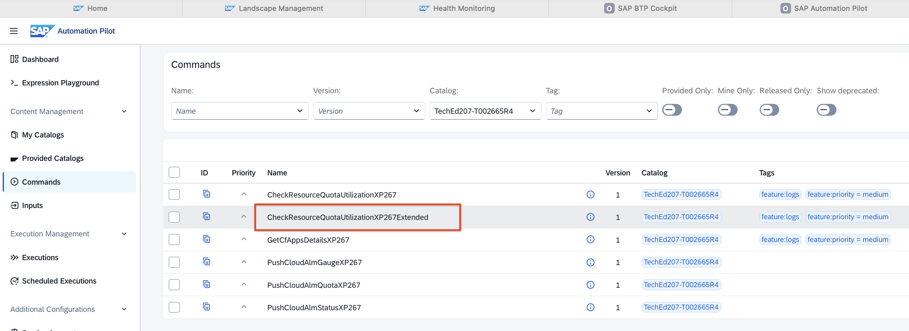
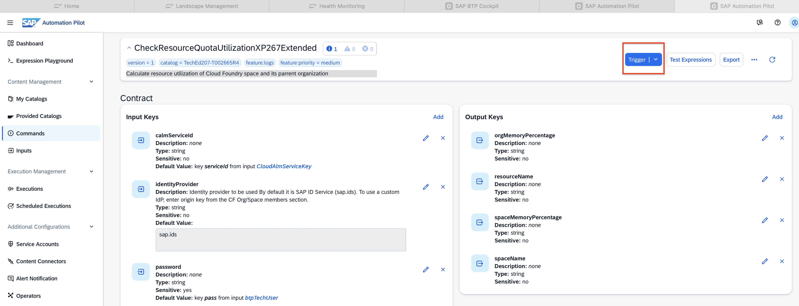
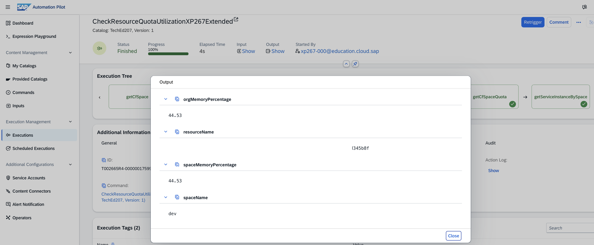
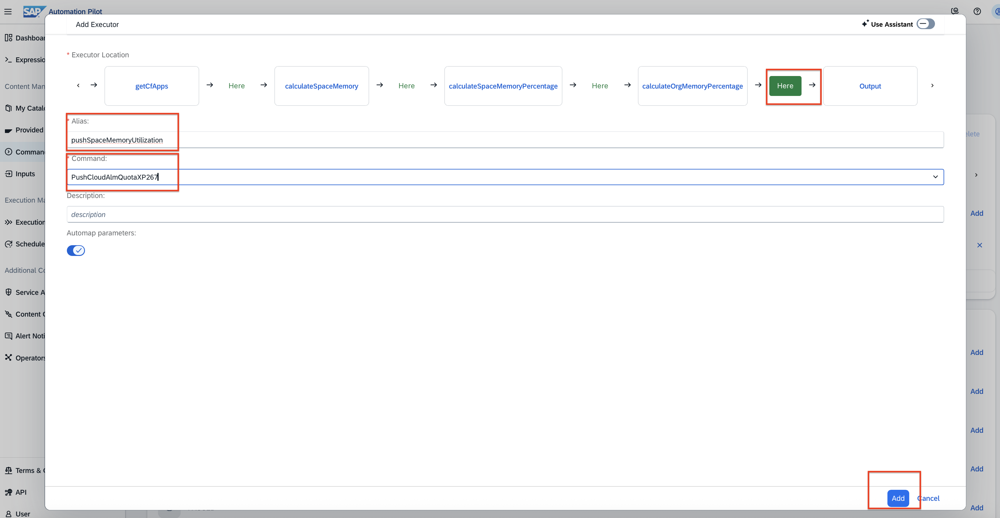
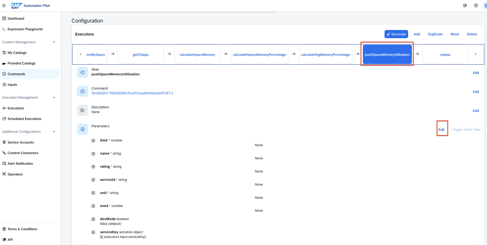
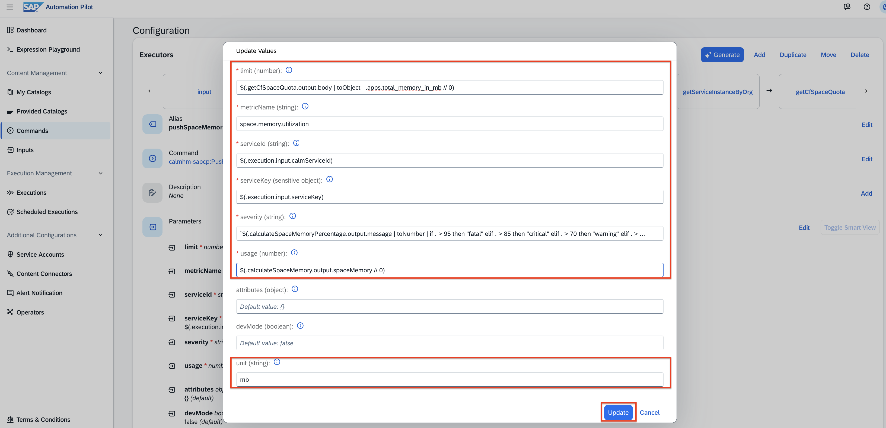

# Exercise 2 - Collect usage metrics with SAP Automation Pilot for you BTP Subaccount and push these to SAP Cloud ALM

In this exercise, we will: 
- Collect usage metrics with SAP Automation Pilot 
- Use existing commands in SAP Automation Pilot to push these metrics to SAP Cloud ALM 
- Consume the custom metrics in SAP Cloud ALM - Health Monitoring  

For a better understanding of the currnet use case, please consult the diagram shared below: 

## Exercise 2.1  Collect usage metrics with SAP Automation Pilot 

**Access SAP Automation Pilot**  and navigate via the left menu to **My Catalogs** --> click on **Commands** for the catalog `XP267 Ex02 - Custom Metrics into Cloud ALM`

Navigate to the command named `CheckResourceQuotaUtilizationXP267Extended`

Thus command is already configured to calculate resource utilization of Cloud Foundry space and its parrent organization for your subaccount. 
Trigger the command , no any further inputs are needed. 

After the command succesful execution, consult the output values by clicking on **Show** link under Output. 

That's a current snapshot of the resource utilization of Cloud Foundry space and its parrent organization for your subaccount. 

## Exercise 2.2  Use existing commands in SAP Automation Pilot to push these metrics to SAP Cloud ALM 

Now we want to push these metrics into SAP Cloud ALM - Health Monitoring. To do so, we'll need to extent this existing command. 

**Go to the command itself**, scroll-down to the **Executor section** and click on **Add** button. 

Add the Executor 
- **Place the new executor** just before the Ouput by clickin on **Here** botton.

- **Alias** - `pushSpaceMemoryUtilization` 

- **Command** - `PushCloudAlmQuotaXP267` - that's a command in SAP Automation Pilot that pushes quota data directly into SAP Cloud ALM metrics API.

- **Keep enabled** the `Automap parameters`

- Click on **Add** button

Now navigate to the executor you just created `pushSpaceMemoryUtilization` and click on the **Edit** button to update its parameters. 

Update the values accordingly: 

- limit - `$(.getCfSpaceQuota.output.body | toObject | .apps.total_memory_in_mb // 0)`

- name - `space.memory.utilization`

- rating - `$(.calculateSpaceMemoryPercentage.output.message | toNumber | if . > 95 then "fatal" elif . > 85 then "critical" elif . > 70 then "warning" elif . > 0 then "ok" else "error" end)`

- serviceId - `$(.execution.input.calmServiceId)`

- unit - `mb`

- used - `$(.calculateSpaceMemory.output.spaceMemory // 0)`

Click on the **Update** button. 

**Access SAP Cloud ALM** by following this link here: https://xp267-calm-1hdji9xc.eu10-004.alm.cloud.sap/

**Login** with your user 
Select the **Operations** menu item. 

## Exercise 2.3  Consume the custom metrics in SAP Cloud ALM - Health Monitoring

**Access SAP Cloud ALM** by following this link here: https://xp267-calm-1hdji9xc.eu10-004.alm.cloud.sap/

**Login** with your user 
Select the **Operations** menu item. 

