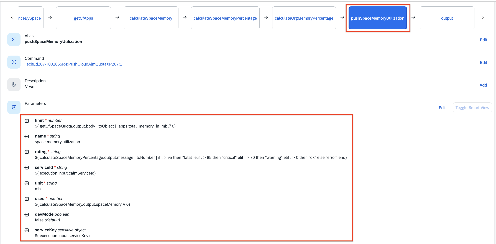
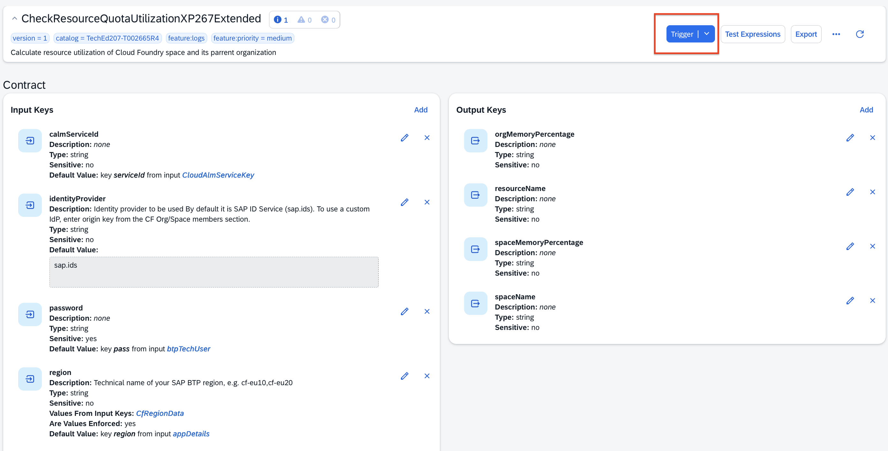
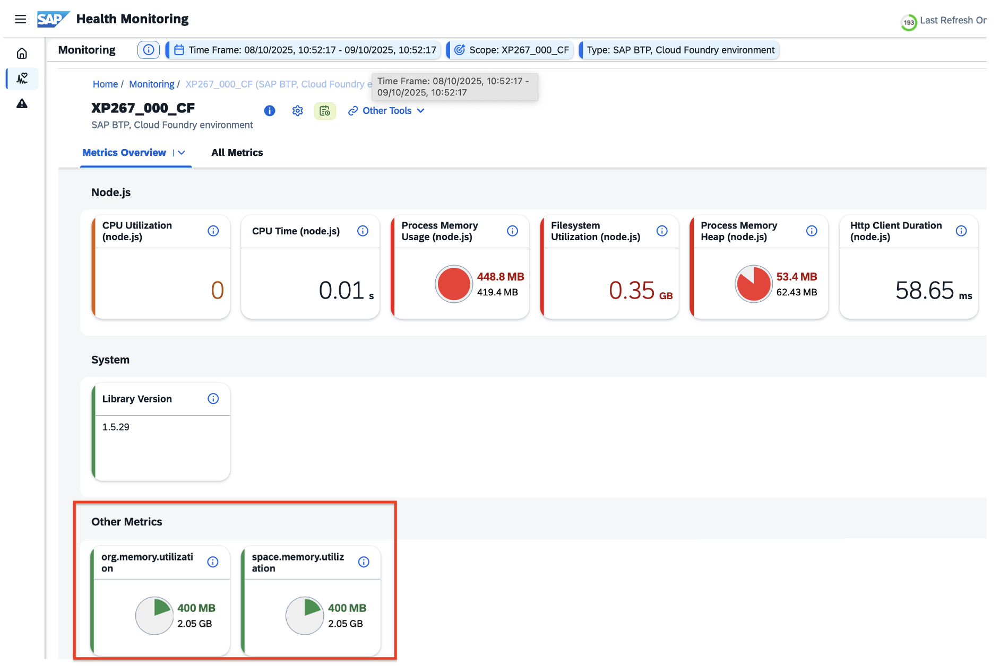
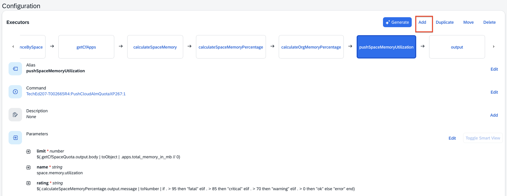
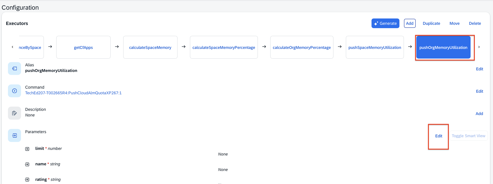
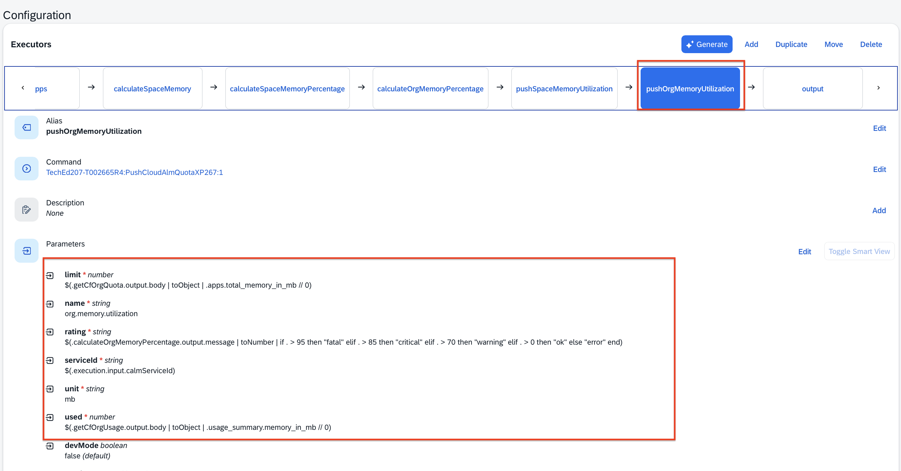

# Exercise 2 - Collect usage metrics with SAP Automation Pilot for your BTP Subaccount and push these to SAP Cloud ALM

In this exercise, we will: 
- Collect usage metrics with SAP Automation Pilot 
- Use existing commands in SAP Automation Pilot to push these metrics to SAP Cloud ALM 
- Consume the custom metrics in SAP Cloud ALM - Health Monitoring  

For a better understanding of the current use case, please consult the diagram shared below: 

## Exercise 2.1  Collect usage metrics with SAP Automation Pilot 

**Access SAP Automation Pilot**  and navigate via the left menu to **My Catalogs** --> click on **Commands** for the catalog `XP267 Ex02 - Custom Metrics into Cloud ALM`

Navigate to the command named `CheckResourceQuotaUtilizationXP267Extended`

This command is already configured to calculate resource utilization of Cloud Foundry space and its parent organization for your subaccount. 
**Trigger** the command , no any further inputs are needed. 

After the command successful execution, consult the output values by clicking on **Show** link under Output. 

That's a current snapshot of the resource utilization of Cloud Foundry space and its parent organization for your subaccount. 

_HINT: the output provides the insights that 19.53% out of your memory allocated for both Organisation and CF Space are currently allocated._

## Exercise 2.2  Use existing commands in SAP Automation Pilot to push these metrics to SAP Cloud ALM 

Now we want to push these metrics into SAP Cloud ALM - Health Monitoring. To do so, we'll need to extend this existing command: `CheckResourceQuotaUtilizationXP267Extended`

**Go to the command itself**, scroll-down to the **Executor section** and click on **Add** button. 

Add the Executor 
- **Place the new executor** just before the Output by clicking on the **Here** botton.

- **Alias** - `pushSpaceMemoryUtilization` 

- **Command** - `PushCloudAlmQuotaMetric` - that's a command in SAP Automation Pilot that pushes quota data directly into SAP Cloud ALM metrics API.

- **Keep enabled** the `Automap parameters`

- Click on **Add** button

Now navigate to the executor you just created `pushSpaceMemoryUtilization` and click on the **Edit** button to update its parameters. 

Update the values accordingly: 

- **limit** - `$(.getCfSpaceQuota.output.body | toObject | .apps.total_memory_in_mb // 0)`

- **metricName** - `space.memory.utilization`

- **serviceId** - `$(.execution.input.calmServiceId)`

- **serviceKey** - DO NOT modify it as it should be already mapped (it should be: `$(.execution.input.serviceKey)` ) 

- **severity** - `$(.calculateSpaceMemoryPercentage.output.message | toNumber | if . > 95 then "fatal" elif . > 85 then "critical" elif . > 70 then "warning" elif . > 0 then "ok" else "error" end)`

- **usage** - `$(.calculateSpaceMemory.output.spaceMemory // 0)`

- **unit** - `mb`

Click on the **Update** button. 

Navigate to the executor `pushSpaceMemoryUtilization` and validate the parameters you just had added. It should look like this one:

**Trigger the command in SAP Automation Pilot**

Now it is all set and you can trigger the command in SAP Automation Pilot. 
To do so, click on the **Trigger** button located in the the top right screen and proceed further as no further inputs are needed.

**Success** - the commands have been completed and data is pushed to SAP Cloud ALM! 

Now let's check the data ingested into SAP Cloud ALM - Health Monitoring. 

## Exercise 2.3  Consume the custom metrics in SAP Cloud ALM - Health Monitoring

**Access SAP Cloud ALM** by following this link here: https://xp267-calm-1hdji9xc.eu10-004.alm.cloud.sap/

**Login** with your user --> select the **Operations** menu item --> **Health Monitoring**

Within Health Monitoring Overview, click on **Monitoring**

Click on your SAP BTP Cloud Foundry environment `XP267_OXX_CF` (as per the username assigned to you, in example, XP267_001_CF) 

You will open the **Metrics Overview** screen in Health Monitoring. Within the very same screen, scroll-down to **Other Metrics** section and you will find the metric you just had pushed - `space.memory.utilization` with the respective values pushed by SAP Automation Pilot. 

Congrats - you can now feed directly your Observability platform with any metric you might wish to bring in.

_**Hint - Optional:**_

From this screen, you could click on a metric such as `space.memory.utilization` to view additional details — including its **information**, **rating**, and **current value**.  
Click on the **History** button to explore historical trends.  

> 💡 **Note:**  
> Your environment might not yet show historical data,** so this view may differ.**
> However, this feature allows you to analyze how a metric’s value changes over time once multiple data entries are collected, providing deeper operational insights.
Example screenshot - in your environment you don't have historical data and therefore such an image won't be possible to be displayed now. 

### Congrats - you can now feed directly your Observability platform with any metric you might wish to bring in.

## Summary

You've now learned how to extend your commands in SAP Automation Pilot by adding new executors to them and reusing also existing command. Moreover, you had managed to trigger command in Automation Pilot that collects further details about your landscape and consume these in a central observability platform such as SAP Cloud ALM. Once that's done, metrics' data is kept in SAP Cloud ALM and it gets visualised in a dashboard such as Metrics Overview in Health Monitoring for further exploration and analysis.

Continue to - [Exercise 3 - Exercise 3 Description](../ex3/README.md)

----------------

### [Optional] - Extend the existing command in SAP Automation Pilot by pushing Org Memory Utilization metric to SAP Cloud ALM  

> **Note (Optional Exercise):**  
> This exercise is **optional**. Due to time limitations, it is **recommended to proceed with the next tasks** first.  
> You can return to the optional exercises **after completing the full scenario**, if time permits.

In case you have more than one CF Spaces, it might be beneficial to keep an eye on the total memory utilized in your BTP Organization. You could extend the command you were working on in this exercise named `CheckResourceQuotaUtilizationXP267Extended` . 

To do so, navigate to the command itself add another executor next to it. 

The executor will be about pushing the current usage for all our CF spaces on Org level (_hint: beneficial, in case we do have more than one CF Space_). 

Now go to the executors section in your command and click on the **Add** button to add a new executor within you automation flow. 

Add the Executor 
- **Place the new executor** just before the Output by clicking on **Here** button.

- **Alias** - `pushOrgMemoryUtilization` 

- **Command** - `PushCloudAlmQuotaMetric` - that's a command in SAP Automation Pilot that pushes quota data directly into SAP Cloud ALM metrics API.

- **Keep enabled** the `Automap parameters`

- Click on **Add** button

Now navigate to the executor you just created `pushOrgMemoryUtilization` and click on the **Edit** button to update its parameters. 

Update the values accordingly: 

- **limit** - `$(.getCfOrgQuota.output.body | toObject | .apps.total_memory_in_mb // 0)`

- **metricName** - `org.memory.utilization`

- **serviceId** - `$(.execution.input.calmServiceId)`

- **serviceKey** - DO NOT modify it as it should be already mapped (it should be: `$(.execution.input.serviceKey)` ) 

- **severity** - `$(.calculateOrgMemoryPercentage.output.message | toNumber | if . > 95 then "fatal" elif . > 85 then "critical" elif . > 70 then "warning" elif . > 0 then "ok" else "error" end)`

- **usage** - `$(.getCfOrgUsage.output.body | toObject | .usage_summary.memory_in_mb // 0)`

- **unit** - `mb`

Click on the **Update** button. 

Navigate to the executor `pushOrgMemoryUtilization` and validate the parameters you just had added. It should look like this one:

**Trigger the command in SAP Automation Pilot**

Now it is all set and you can trigger the command in SAP Automation Pilot. 
To do so, click on the **Trigger** button located in the top right screen and proceed further as no further inputs are needed.

**Success** - the command has been completed and data is pushed to SAP Cloud ALM! 

Now let's check the data ingested into SAP Cloud ALM - Health Monitoring. 

Consume the custom metrics in SAP Cloud ALM - Health Monitoring

**Access SAP Cloud ALM** by following this link here: https://xp267-calm-1hdji9xc.eu10-004.alm.cloud.sap/

**Login** with your user --> select the **Operations** menu item --> **Health Monitoring**

Within Health Monitoring Overview, click on **Monitoring**

Click on your SAP BTP Cloud Foundry environment `XP267_OXX_CF` (as per the username assigned to you, in example, XP267_001_CF) 

You will open the **Metrics Overview** screen in Health Monitoring. 

Within the very same screen, scroll-down to **Other Metrics** section and you will find the newly added metric -  `org.memory.utilization` with the respective values pushed by SAP Automation Pilot. 

Congrats - you can now feed directly your Observability platform with more metrics you might wish to bring in.

## Summary

You have successfully:  
- Collected **usage metrics** from your **SAP BTP subaccount** using **SAP Automation Pilot**  
- Extended an existing command by adding new **executors** to push data into **SAP Cloud ALM**  
- Viewed and analyzed **custom metrics** in **SAP Cloud ALM – Health Monitoring**  
- (Optionally) Enhanced observability by pushing **organization-level metrics** 

Proceed to the next step:  
➡️ [Exercise 3 – Extend SAP Automation Pilot with SAP AI Core for Log Assessment and AI Recommendations](../ex3/README.md)
