# Exercise 3 – Extend SAP Automation Pilot with SAP AI Core for Log Assessment and AI Recommendations

In this exercise, you will:
- Run and extend a command in **SAP Automation Pilot** to collect application logs and **Cloud Foundry environment details**  
- Integrate SAP Automation Pilot with **SAP AI Core** to provide logs and context to an AI model for assessment and recommendations  
- Retrieve a summarized assessment in Automation Pilot and **push AI-powered insights to SAP Cloud ALM – Health Monitoring**

> **Context:**  
> In **Exercise 2**, you pushed custom usage metrics to **SAP Cloud ALM** . 
> Here, you will enrich your observability with **AI-generated assessments** based on real application logs and environment context.

For a better understanding of the use case, refer to the diagram below:  
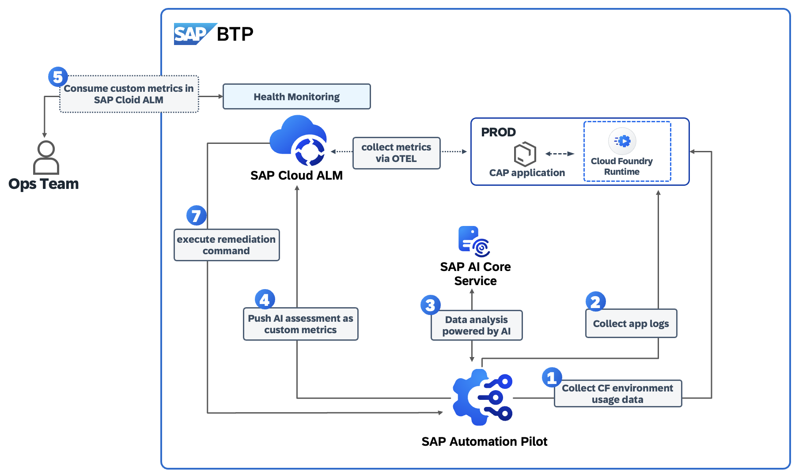

---

## Exercise 3.1 – Collect App Logs and State Using a Command in SAP Automation Pilot

1. In **SAP Automation Pilot**, navigate to **My Catalogs → Commands** under the catalog:  
   `XP267 Ex03 – AI Powered Commands`  
   

2. Open the command **`AppLogsAnalysisByAI`**.  
   

   This command is preconfigured to collect logs, current state, and the latest events for your CAP application.

3. Click **Trigger** to execute (no input required).  
   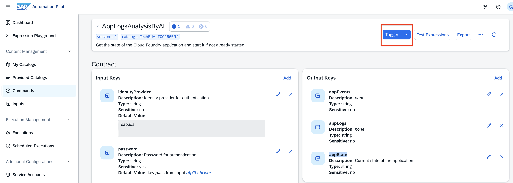

4. After successful execution, click **Show** under **Output** to review the collected data.  
   

   You now have a snapshot of CAP app logs, state, and events.  
   

### Extend the Command by Adding an Output Key for State Memory

1. In the **Output Keys** section, click **Add**.  
   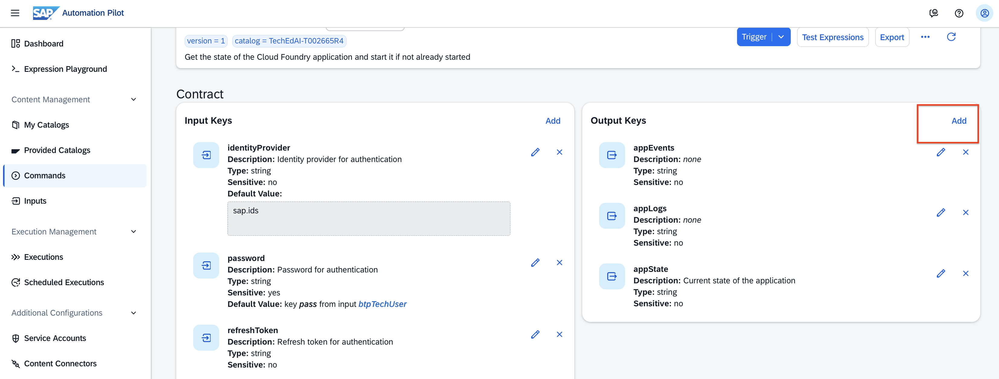

   Fill in:  
   - **Name**: `stateMemory`  
   - **Type**: `number`  

   Click **Add**.  
   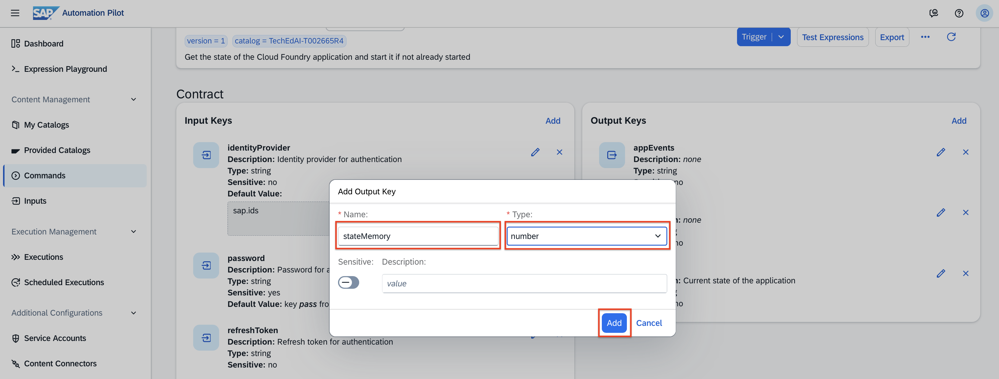

2. Scroll down to **Configuration**, open the **output** executor, click **Edit**, and map the value:  
   - **stateMemory**: `$(.GetAppState.output.memory)`  

   Click **Update**.  
     
   

3. **Trigger** the command again and review the **Output**.  
   You should see the memory allocated for the space where your CAP app runs (e.g., **400 MB**).  
   

---

## Exercise 3.2 – Integrate SAP Automation Pilot with SAP AI Core for AI Assessment & Recommendations

Now that you collect the relevant data, let’s add an AI-based assessment using **SAP AI Core**.

> **Note:** An SAP AI Core service and model deployment are already prepared.  
> The **Service Key** is stored in your Automation Pilot tenant.

1. Open the command **`AppLogsAnalysisByAI`**, scroll to **Executors**, and click **Add**.

2. Configure the executor:  
   - **Placement**: just before **Output** (click **Here**)  
   - **Alias**: `AICoreAnalyze`  
   - **Command**: `GenerateGpt4OmniCompletion` (sends data to AI Core and returns a response)  
   - Keep **Automap parameters** enabled  
   - Click **Add**  
   

3. Edit **`AICoreAnalyze`** and set:  
   

   - **deploymentId**: `$(.AICoreData.deploymentId)`  
   - **prompt**: `App logs are $(.GetAppLogs.output.logs) , have in mind also the memory allocated within the Cloud Foundry space = "$(.GetAppState.output.memory) MB"`  
   - **serviceKey**: `$(.AICoreData.serviceKey)`  
   - **systemMessage**:  
     ```
     You are an AI assistant with expertise in CAP NodeJS applications. You will receive application logs and the allocated memory for a CAP NodeJS application running on BTP Cloud Foundry. Your task is to analyze these logs and provide a summary highlighting the application's current state and any potential issues.
     ```

   Click **Update**.  
   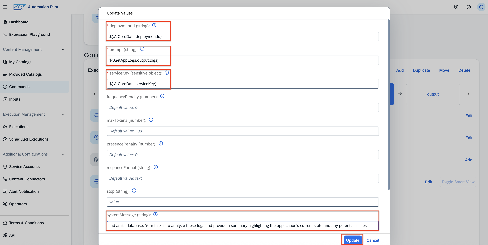  
   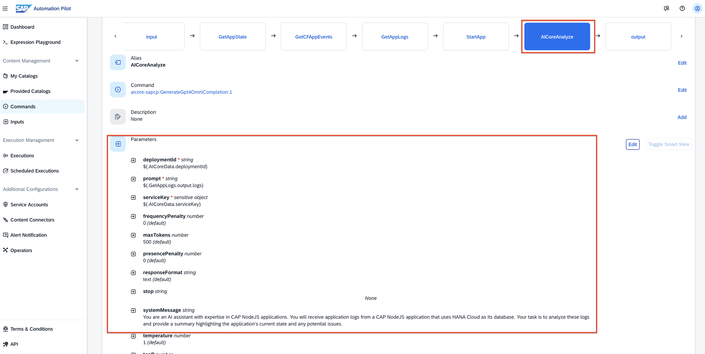

### Expose the AI Assessment as an Output

1. In **Output Keys**, click **Add**.  
   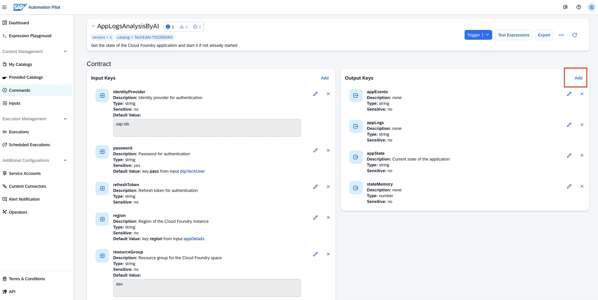

   - **Name**: `AIOutput`  
   - **Type**: `string`  

   Click **Add**.  
   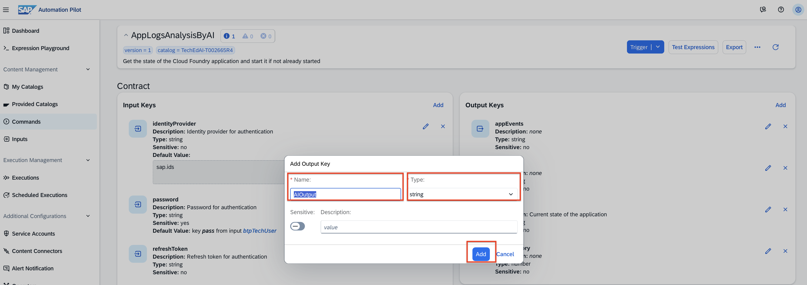

2. Map the output in the **output** executor (**Edit**):  
   - **AIOutput**: `$(.AICoreAnalyze.output.response)`  

   Click **Update**.  
     
   

3. **Trigger** the command. After completion, click **Show** under **Output** to read the AI assessment.  
   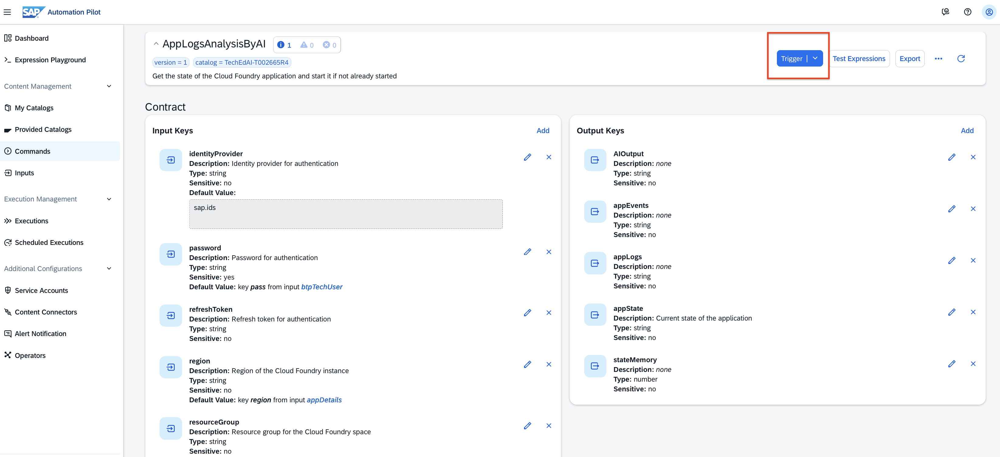  
     
   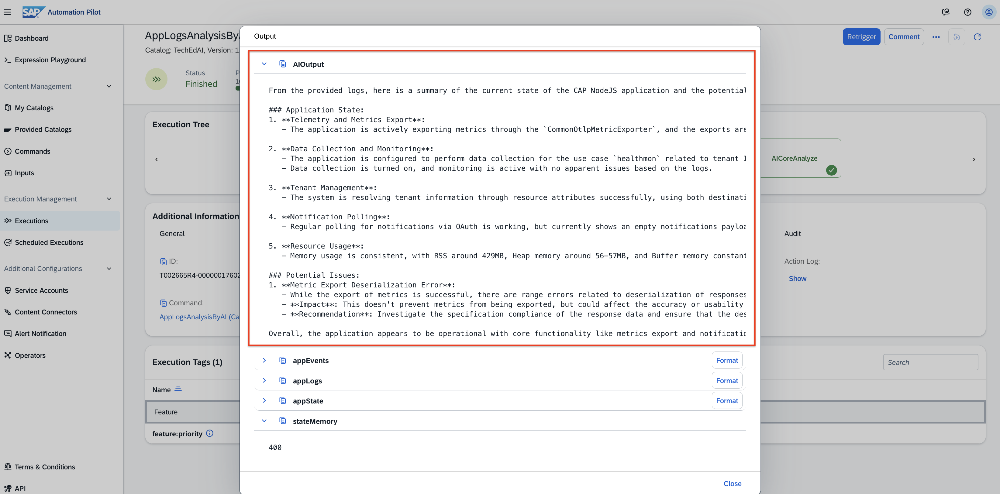

---

## [ 🧩 Optional ] Exercise 3.3 – Generate a One-Word Health Status Summary via SAP AI Core

Let’s obtain a concise **single-status** health summary (`OK`, `Investigate`, or `Critical`) suitable for dashboards.

1. In **`AppLogsAnalysisByAI`**, add another executor:  
   - **Placement**: before **Output**  
   - **Alias**: `AICoreAnalyzeSummary`  
   - **Command**: `GenerateGpt4OmniCompletion`  
   - Keep **Automap parameters** enabled  
   - Click **Add**    
   

2. Edit **`AICoreAnalyzeSummary`** (note: ensure you edit the *Summary* executor):  
   

   - **deploymentId**: `$(.AICoreData.deploymentId)`  
   - **prompt**: `$(.AICoreAnalyze.output.response)`  _(reuse the previous AI result)_  
   - **serviceKey**: `$(.AICoreData.serviceKey)`  
   - **systemMessage**:  
     ```
     You are an AI assistant with expertise in CAP NodeJS applications. You will receive an analysis of the logs from a CAP NodeJS application running on Cloud Foundry space. Your task is to analyze further the inputs and provide your assessment about the app health in just one status (use one out of these statuses as a single word without any formatting: OK, Investigate, Critical).
     ```

   Click **Update**.  
     
   

3. Add a new **Output Key**:  
   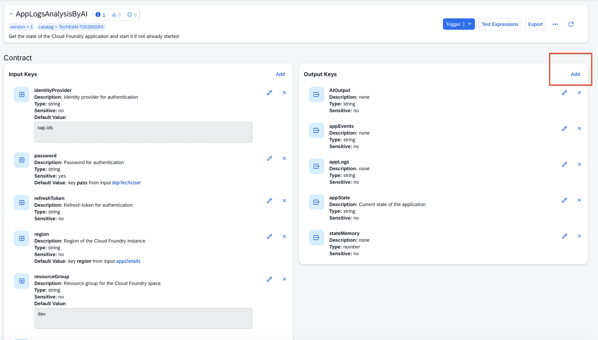

   - **Name**: `AIOutputSummary`  
   - **Type**: `string`  

   Click **Add**.  
   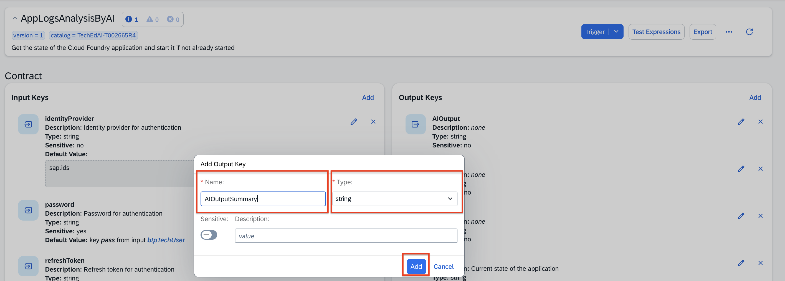

4. Map the summary in the **output** executor (**Edit**):  
   - **AIOutputSummary**: `$(.AICoreAnalyzeSummary.output.response)`  

   Click **Update**.  
     
   

5. **Trigger** the command and check **Output**. You should see `AIOutputSummary` with a one-word status (e.g., `Investigate`).  
     
     
   

---

## [ 🧩 Optional ] Exercise 3.4 – Add AI Insights Focused on Memory Consumption

Add an AI analysis specialized in **memory utilization**, plus a **short summary**.

1. Add an executor:  
   - **Alias**: `AICoreMemoryAnalysis`  
   - **Command**: `GenerateGpt4OmniCompletion`  
   - **Placement**: before **Output**  
   - Keep **Automap parameters** enabled  
   - Click **Add**  
   

2. Edit **`AICoreMemoryAnalysis`** and set:  
   - **deploymentId**: `$(.AICoreData.deploymentId)`  
   - **prompt**:  
     ```
     Available memory allocated within the Cloud Foundry space = "$(.GetAppState.output.memory) MB" and App logs are $(.AICoreAnalyze.output.response)
     ```
   - **serviceKey**: `$(.AICoreData.serviceKey)`  
   - **systemMessage**:  
     ```
     You are an AI assistant with expertise in CAP NodeJS applications. You will receive as inputs the available memory allocated within the Cloud Foundry space where the app runs and the logs from the same CAP NodeJS application. Analyze these inputs and provide an assessment of the app's memory utilization with recommendations focused only on memory utilization.
     ```

   Click **Update**.

3. Add another executor for a **very short memory summary** (≤ 3 words):  
   - **Alias**: `AICoreMemoryAnalyzeSummary`  
   - **Command**: `GenerateGpt4OmniCompletion`  
   - **Placement**: before **Output**  
   - Keep **Automap parameters** enabled  
   - Click **Add**  
   

4. Edit **`AICoreMemoryAnalyzeSummary`** and set:  
   

   - **deploymentId**: `$(.AICoreData.deploymentId)`  
   - **prompt**:  
     ```
     Available memory allocated within the Cloud Foundry space = "$(.GetAppState.output.memory) MB" and App logs are $(.AICoreAnalyze.output.response)
     ```
   - **serviceKey**: `$(.AICoreData.serviceKey)`  
   - **systemMessage**:  
     ```
     You are an AI assistant with expertise in CAP NodeJS applications. You will receive the available memory for the Cloud Foundry space and the app logs. Analyze and provide an assessment of the app's memory utilization summarized in up to 3 words.
     ```

   Click **Update**.

5. Add **Output Keys** and map them:  
   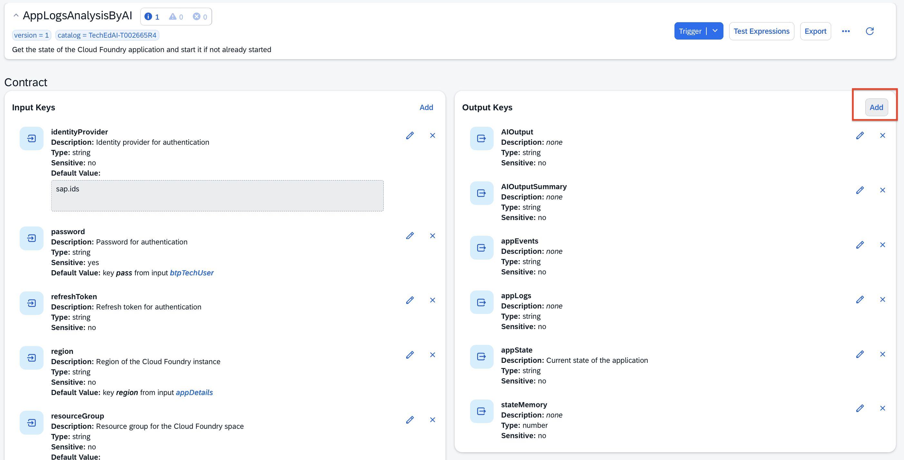

   - **AIOutputMemory** (`string`) → `$(.AICoreMemoryAnalysis.output.response)`  
   - **AIOutputMemorySummary** (`string`) → `$(.AICoreMemoryAnalyzeSummary.output.response)`  

   Save the mappings in the **output** executor.  
     
   

6. **Trigger** the command and check **Output** for both memory fields.  
   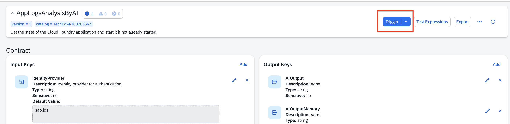  
     
   

---

## Exercise 3.5 – Push AI Insights to SAP Cloud ALM – Health Monitoring

To push the AI results to **SAP Cloud ALM**, use the extended command:

1. Go to **My Catalogs** → `XP267 Ex03 – AI Powered Commands` → **Commands**.  
   

2. Open **`AppLogsAnalysisByAIExtendedPushToCloudALM`**.  
   

   This version includes two additional executors:  
   - **`pushAppSummary`** – sends the **AI health status** (`AICoreAnalyzeSummary`) to Cloud ALM  
     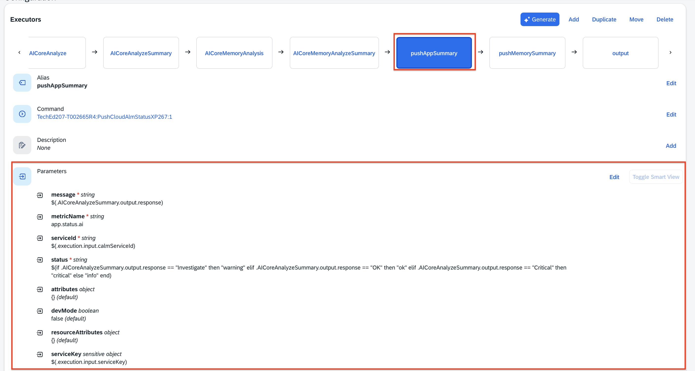
   - **`pushMemorySummary`** – sends the **memory summary** (`AICoreMemoryAnalyzeSummary`) to Cloud ALM  
     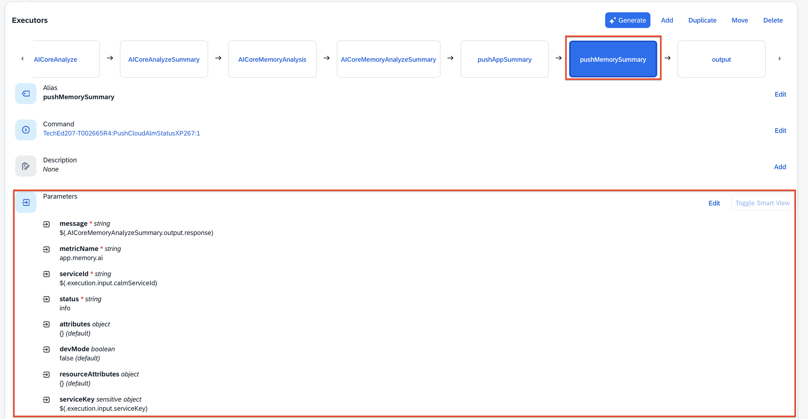

3. **Trigger** the command. After completion, verify outputs and success state.  
   

---

## Exercise 3.6 – View AI Metrics in SAP Cloud ALM – Health Monitoring

1. Access **SAP Cloud ALM**:  
   [https://xp267-calm-1hdji9xc.eu10-004.alm.cloud.sap/](https://xp267-calm-1hdji9xc.eu10-004.alm.cloud.sap/)

2. Log in → **Operations → Health Monitoring**.

3. Ensure **Scope** includes your subaccount (e.g., `XP267-0XX_CF`) and open your **Cloud Foundry** environment.  
   

4. In **Metrics Overview**, under **Other Metrics**, find the new AI-driven metrics:  
   - `app.memory.ai`  
   - `app.status.ai`  

   These are the insights you just pushed from SAP Automation Pilot.  
   

---

## Summary

You have successfully:
- Collected app logs and state in **SAP Automation Pilot**  
- Integrated with **SAP AI Core** to generate assessments and recommendations  
- Produced a one-word **health status** and a concise **memory summary**  
- Pushed AI insights to **SAP Cloud ALM – Health Monitoring** for centralized observability

Proceed to the next step:  
➡️ [Exercise 4 – Trigger a Remediation Command in SAP Automation Pilot Directly from SAP Cloud ALM](../ex4/README.md)
