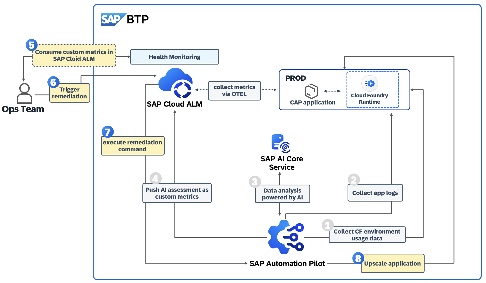

# Exercise 4 - Trigger a remediation command in SAP Automation Pilot directly from  SAP Cloud ALM

In this exercise, we will: 
- Consume an alert in SAP Cloud ALM Health Monitoing
- Trigger a command in SAP Automation Pilot from SAP Cloud ALM to remediate the alert
- Validate the result out of the command completion and close the alert in SAP Cloud ALM - Health Monitoring. 

For a better understanding of the currnet use case, please consult the diagram shared below: 

## 4.1  Consume an alert in SAP Cloud ALM Health Monitoing and trigger a command in SAP Automation Pilot 

In the previous execircise we had found out that the memory in our application consumes memory threshold which reaches the limit allocated on a Cloud Foundry level. At the same we got a recommendation to upscale the memory for our app. To save time and be more efficient, we will do so by using a command in SAP Automation Pilot. The command can be triggered directly from SAP Cloud ALM. 

**Access SAP Cloud ALM** by following this link here: https://xp267-calm-1hdji9xc.eu10-004.alm.cloud.sap/

**Login** with your user 
Select the **Operations** menu item. 

Click on **Health Monitoring** capability. 

You will land at Health Monitoring Overview screen. 
Make sure Scope has been selected to your subaccount XP267-0XX_CF (e.g. XP267_000_CF)

Click on the **Alerting icon** within the left sidebar menu:  and you shall be able to see the services/ system visible in the Health Monitoring. 

You shall see at least one active alert: `High Memory Utilization (node.js)`/ 
**Click** on this alert.

Now you got into the Alert details. Click on **Actions** button to explore the potential actions you may undertake.

From the drop-down menu, click on **Start Operation Flow**.

Then click on **Register Operation Flow** and select **SAP Automation Pilot** 

_Note: that's a one time effort , you need to register each command in SAP Automation Pilot that you want to be available to be consumed / triggered directly from SAP Cloud ALM. _

Within the popup **Register SAP Automation Pilot** follow these steps: 

- Endpoint - `AP-XP267-XXX` (e.g. as per the user provided, in example, if your user is XP267_001 , then the endpoint is `AP-XP267-001`, remeber also Excercise 01 where you had created the Automation Pilot endpoint in the SAP Cloud ALM - Landscape Management )

- click on the **ID** field and the icon to reference an existing command

- from the expanded screen **Select SAP Automation Pilot** find the command `UpscaleAppXP267UserXXX` (e.g. as per the user provided, in example, if your user is XP267_001 , then the endpoint is `UpscaleAppXP267User001`)

- Click on the **command itself**.

- Click on the **OK** button.

- You have just registered the command to upscale the memory of your app. Click on the **Start** button to trigger it right away!

Now it is time to validate the execution. 

From the **Alert** details page , click on the **Operation Flow** tab. 

You see the name of SAP Automation Pilot command you just have triggered and its status. Click on the **Instance ID** unique ID to access the command directly in SAP Automation Pilot and check the outputs. 

A new popup gets open and you see the command completion screen in SAP Automation Pilot. 
Now click on the Outpout **Show** link to check the command output values. 

You can see that the app has been restarted and the state is `RUNNING` - it looks like the command had upscaled memory allocated within the CF space where you app runs. 

Let's also check it out via BTP Cockpit. In your BTP subaccount already provided go to your Cloud Foundry `dev` space. 

Let's navigate to the app itsef `bookshop-srv` and get further insights about app current state: 

- **Memory per Instance** had been increased from 400 MB to 656 MB.

- Withi the **Moast Recent Application Events** you can find out the upscaling event `audit.app.process.scale`.
  

Well done - the memory allocated for your CAP app has been increased! 

**HINT**: let's explore the SAP Automation Pilot command triggered `UpscaleAppXP267UserXXX` . Go to the executor `setAppResources` , check the parameter `memory` --> you will see the folliwing values: `$(.getAppState.output.memory + 256)` . That's a configuration so we take the current memory allocated to the CF space and we add 256 MB on top of it . Of course the value `256` can be modified , can be added as a dynamic input parameter, or a manual value that is to be entered by the user along the command execution. 

We are all set, app is running fine, let's close the alert in SAP Cloud ALM - Health Monitoring. 

**Access** again S**AP Cloud ALM - Health Monitoring**. 

Navigate to the **Alerts** and **Alert details page**. 

Click on the Actions button and then select **Confirm**. 

**Success!!** - you had remediated the situation you just had had and the alert is now closed! 

## Summary

Awesome - you all done! 
You've now learned the how to register automation flows in SAP Cloud ALM Health Monitoring and remediate ops issues with triggering commands directly in SAP Automation Pilot. 

